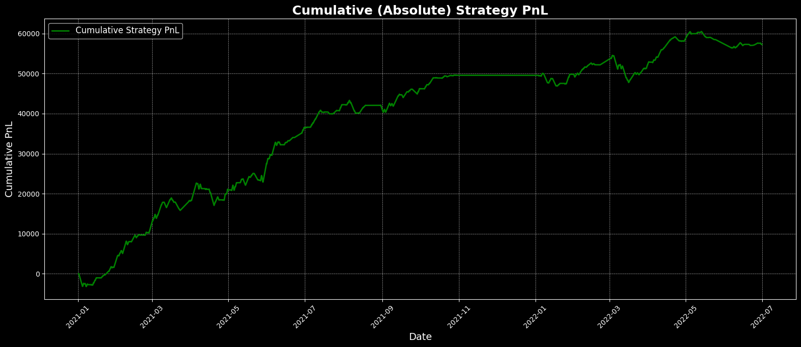
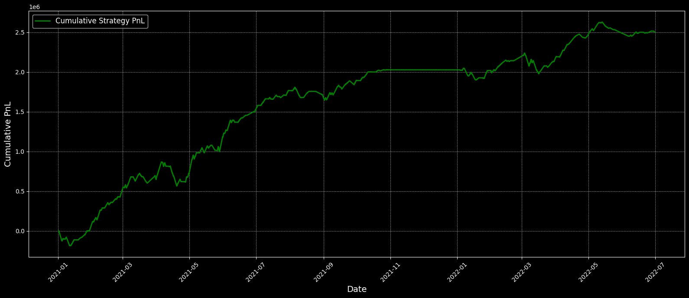

# Volatility Pairs Trading Strategy: Nifty & Bank Nifty

This repository contains a practical implementation of a volatility pairs trading strategy for Nifty and Bank Nifty index Futures . The approach is based on statistical arbitrage, aiming to profit from temporary divergences in implied volatility between these two highly correlated indices.


## Data

- **Source**: `data.parquet`
- **Fields**: Nifty IV, Bank Nifty IV, Time To Expiry (TTE)
- **Frequency**: 1-minute bars


## Strategy Models

### Base Model
**Core Logic:**
- Calculates the spread: `spread = banknifty_iv - nifty_iv`
- Computes P&L: `pnl = spread * (tte ** 0.7)`
- Uses a rolling z-score of the spread to generate trading signals.
- `Entry/Exit` thresholds and lookback window are optimized by grid search.

**Code Analysis:**
- **Data Loading:** Reads parquet data, converts index to datetime, forward-fills missing values.
- **Spread & PnL Calculation:** Direct difference of IVs, scaled by time-to-expiry.
- **Parameter Optimization:** Grid search over entry/exit z-score thresholds and rolling window sizes.
- **Signal Generation:**  
  - Enter long if z-score < -entry threshold  
  - Enter short if z-score > entry threshold  
  - Exit if z-score crosses exit threshold  
  - Position states: Long (1), Short (-1), Flat (0)
- **Performance Calculation:**  
  - Daily PnL aggregation  
  - Annualized Sharpe Ratio  
  - Drawdown and win rate metrics  
  - Trade count and average trade duration (trading hours only)
- **Risk Management:**  
  - Fixed position size  
  - No stop-loss or dynamic sizing  
  - No regime detection

**Limitations:**
- Assumes normal distribution of spread
- Static lookback window and thresholds
- No market microstructure or transaction cost modeling

---

### Cumulative PnL - Base Model



### Advanced Model

**Core Logic:**
- Uses a cointegrated spread: `coint_spread = 38.8518 * nifty - 39.1766 * banknifty`
- Applies volatility regime classification (low, medium, high) to adapt thresholds.
- Multiple rolling windows for feature engineering.
- Trades only during 10:00 to 15:00 IST.

**Code Analysis:**
- **Cointegration:**  
  - Linear combination of Nifty and Bank Nifty IVs (coefficients from statistical analysis)
  - Produces a mean-reverting spread
- **Feature Engineering:**  
  - Rolling mean and std for multiple windows (90, 120, 150, 180 min)
  - Z-score features for each window
- **Regime-Based Trading:**  
  - Volatility regimes based on spread std percentiles  
  - Entry/exit thresholds adapt to regime:
    - Low: (1.2, 0.5)
    - Medium: (1.5, 0.7)
    - High: (2.0, 0.6)
- **Signal Generation:**  
  - Trades only during 10:00-15:00 (hour mask)
  - Filters trades by volatility regime
  - Dynamic position management (long, short, flat)

- **Risk Management:**  
  - Regime-specific exposure limits
  - Volatility-based position filtering
  - No stop-loss, but more robust to changing market conditions


### Cumulative PnL - Advanced Model



---

## Key Formulas

- **Spread**:  
  `Spread = Bank Nifty IV - Nifty IV`
- **Cointegrated Spread**:  
  `Coint_Spread = 38.8518 * Nifty IV - 39.1766 * Bank Nifty IV`
- **P&L**:  
  `P&L = Spread × (Time To Expiry)^0.7`

---

## Project Structure

```
├── data.parquet          # Raw data
├── base-model.ipynb      # Base z-score model
├── advanced_model.ipynb  # Advanced regime/cointegration model
├── eda.ipynb             # Exploratory analysis
├── results/              # Plots and backtest results
└── grid_search_results.pkl  # Parameter optimization cache
```

## Performance Summary

| Metric                   | Base Model | Advanced Model |
|--------------------------|:-:|:-:|
| Absolute P&L             | 57,293.90  | 2,497,676.25  |
| Sharpe Ratio             | 5.02       | 3.91          |
| Max Drawdown             | -6,770.12  | -301,205.50   |
| Max Drawdown %           | -11.19%    | -11.46%       |
| Win Rate                 | 65.26%     | 64.29%        |
| Trade Count              | 4,858      | 3,926         |
| Avg. Trade Duration (h)  | 0.71       | 0.87          |

---
## Documentation
The full analysis is available in two formats:
- `report.typ`: Source file in Typst format
- `report.pdf`: Rendered PDF output

### Requirements for editing documentation
- Typst (install via `brew install typst`)

### Building the documentation
```bash
# Compile once
typst compile report.typ report.pdf

# Watch for changes
typst watch report.typ report.pdf
```

## Assumptions & Limitations

- Assumes sufficient liquidity for execution
- Ignores transaction costs and slippage
- No market impact modeled

---

